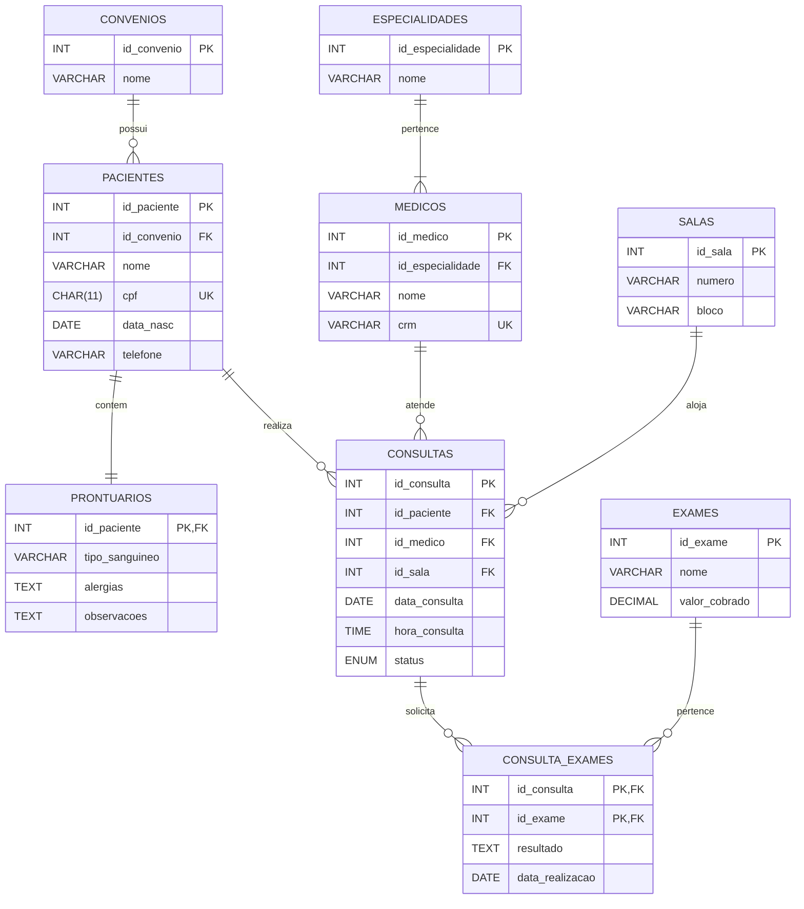

# Sistema de Agendamento de Consultas e Exames (Clínica)

## 1. Mapeamento de Entidades, Atributos e Tipos de Dados

- **convenios**
  - `id_convenio` (INT, PK, AUTO_INCREMENT)
  - `nome` (VARCHAR)

- **pacientes**
  - `id_paciente` (INT, PK, AUTO_INCREMENT)
  - `id_convenio` (INT, FK)
  - `nome` (VARCHAR)
  - `cpf` (CHAR(11), UNIQUE) *Nota: O CPF é do tipo CHAR por ter tamanho fixo. Não é do tipo numérico (INT/BIGINT) pois pode começar com 0 e não se destina a operações matemáticas.*
  - `data_nasc` (DATE)
  - `telefone` (VARCHAR(15))

- **prontuarios**
  - `id_paciente` (INT, PK/FK, UNIQUE) *Nota: A PK deste registro é a própria FK para `pacientes`. Isso garante a relação estrita de 1:1.*
  - `tipo_sanguineo` (VARCHAR(5))
  - `alergias` (TEXT)
  - `observacoes` (TEXT)

- **especialidades**
  - `id_especialidade` (INT, PK, AUTO_INCREMENT)
  - `nome` (VARCHAR(50))

- **medicos**
  - `id_medico` (INT, PK, AUTO_INCREMENT)
  - `id_especialidade` (INT, FK)
  - `nome` (VARCHAR(100))
  - `crm` (VARCHAR(20), UNIQUE) *Nota: O CRM varia de conselho e formato, sendo ideal armazenar como VARCHAR.*

- **salas**
  - `id_sala` (INT, PK, AUTO_INCREMENT)
  - `numero` (VARCHAR(10))
  - `bloco` (VARCHAR(50))

- **consultas**
  - `id_consulta` (INT, PK, AUTO_INCREMENT)
  - `id_paciente` (INT, FK)
  - `id_medico` (INT, FK)
  - `id_sala` (INT, FK)
  - `data_consulta` (DATE)
  - `hora_consulta` (TIME)
  - `status` (ENUM('Agendada', 'Realizada', 'Cancelada'))

- **exames**
  - `id_exame` (INT, PK, AUTO_INCREMENT)
  - `nome` (VARCHAR(100))
  - `valor_cobrado` (DECIMAL(10,2))

- **consulta_exames**
  - `id_consulta` (INT, FK)
  - `id_exame` (INT, FK)
  - `resultado` (TEXT)
  - `data_realizacao` (DATE)
  - *PK Composta: (`id_consulta`, `id_exame`)*

## 2. Cardinalidades

1. **Paciente ↔ Prontuário (1:1)**: Um paciente possui exatamente 1 prontuário, e um prontuário pertence a apenas 1 paciente (relação mútua fechada).
2. **Convênio ↔ Paciente (1:N)**: Um paciente está vinculado a apenas 1 (ou nenhum) convênio vigente, mas um convênio atende a vários pacientes.
3. **Especialidade ↔ Médico (1:N)**: Um médico atua em exatamente 1 especialidade, enquanto uma especialidade compreende vários médicos profissionais.
4. **Paciente ↔ Consulta (1:N)**: Um paciente pode realizar infinitas consultas, mas uma consulta agendada destina-se a somente 1 paciente.
5. **Médico ↔ Consulta (1:N)**: Um médico pode realizar múltiplas consultas, mas aquela consulta tem a atuação de somente 1 médico.
6. **Sala ↔ Consulta (1:N)**: Uma sala aloja múltiplas consultas no decorrer do dia, porém uma determinada consulta, na sua hora marcada, ocorre em somente 1 sala.
7. **Consulta ↔ Exames (N:N)**: Em uma única consulta, o médico pode pedir vários exames, e aquele mesmo tipo de exame pode ser solicitado em diversas outras consultas. Isso gerou a tabela associativa `consulta_exames`.

## 3. Diagrama Entidade-Relacionamento

