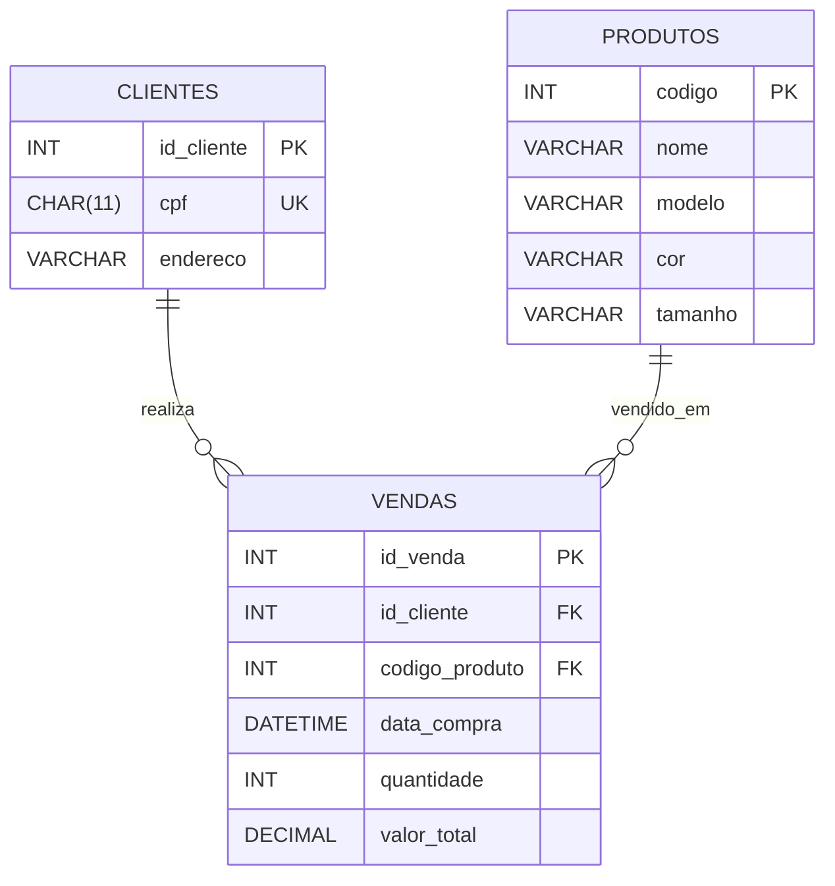
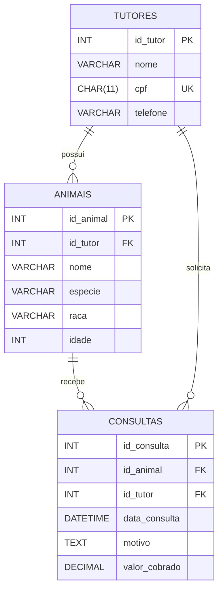
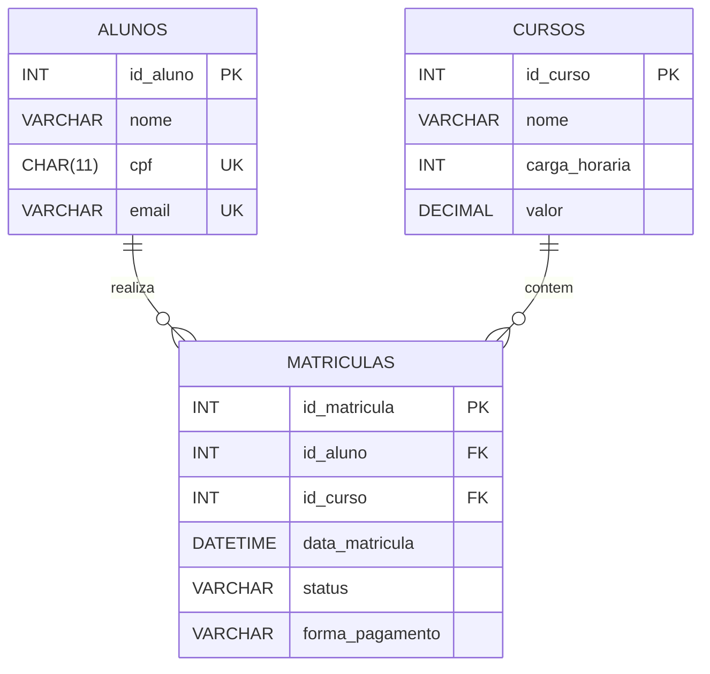

# Exercícios – Extraindo Entidades e Atributos

---

## Exercício 1 – Loja de Artigos Esportivos

### 1. Entidades Identificadas
- **clientes**: Pessoas físicas que compram artigos esportivos.
- **produtos**: Artigos esportivos ofertados na loja.
- **vendas**: Transações de vendas efetuadas na loja.

### 2. Atributos e Identificadores (Chaves Primárias)
- **clientes**
  - `id_cliente` (INT, PK) — *Atributo identificador artificial/surrogate ou podemos utilizar o `cpf` como identificador natural.*
  - `cpf` (CHAR(11), UNIQUE)
  - `endereco` (VARCHAR(255))
- **produtos**
  - `codigo` (INT/VARCHAR, PK) — *Atributo identificador do produto indicado no enunciado.*
  - `nome` (VARCHAR(100))
  - `modelo` (VARCHAR(50))
  - `cor` (VARCHAR(30))
  - `tamanho` (VARCHAR(10))
- **vendas**
  - `id_venda` (INT, PK) — *Atributo identificador da transação de venda.*
  - `id_cliente` (INT, FK)
  - `codigo_produto` (INT/VARCHAR, FK)
  - `data_compra` (DATETIME)
  - `quantidade` (INT)
  - `valor_total` (DECIMAL(10,2))

### 3. Diagrama do Exercício 1

---

## Exercício 2 – Sistema de Clínica Veterinária

### 1. Entidades Identificadas
- **tutores**: Pessoas responsáveis pelos animais atendidos.
- **animais**: Pacientes animais que recebem atendimento na clínica.
- **consultas**: Eventos de atendimento clínico realizados.

### 2. Atributos de Cada Entidade
- **tutores**
  - `id_tutor` (INT, PK)
  - `nome` (VARCHAR(150))
  - `cpf` (CHAR(11), UNIQUE)
  - `telefone` (VARCHAR(15))
- **animais**
  - `id_animal` (INT, PK)
  - `id_tutor` (INT, FK)
  - `nome` (VARCHAR(100))
  - `especie` (VARCHAR(50))
  - `raca` (VARCHAR(50))
  - `idade` (INT)
- **consultas**
  - `id_consulta` (INT, PK)
  - `id_animal` (INT, FK)
  - `id_tutor` (INT, FK)
  - `data_consulta` (DATETIME)
  - `motivo` (TEXT)
  - `valor_cobrado` (DECIMAL(10,2))

### 3. Dependência de Existência
> **Pergunta:** *Existe alguma entidade que depende de outra para existir?*

**Sim.** 
- A entidade **`animais`** depende da existência de um **`tutor`** responsável (um animal sem tutor não é cadastrado no contexto da clínica).
- A entidade **`consultas`** também depende tanto de **`animais`** quanto de **`tutores`** (uma consulta não pode existir sem um animal a ser tratado e um tutor responsável pelo agendamento e pagamento).

### 4. Diagrama do Exercício 2

---

## Exercício 3 – Plataforma de Cursos Online

### 1. Entidades Identificadas
- **alunos**: Usuários estudantes matriculados na plataforma.
- **cursos**: Conteúdos educativos disponibilizados.
- **matriculas**: Registros de inscrições dos alunos nos cursos.

### 2. Atributos de Cada Entidade
- **alunos**
  - `id_aluno` (INT, PK)
  - `nome` (VARCHAR(150))
  - `cpf` (CHAR(11), UNIQUE)
  - `email` (VARCHAR(150), UNIQUE)
- **cursos**
  - `id_curso` (INT, PK)
  - `nome` (VARCHAR(100))
  - `carga_horaria` (INT)
  - `valor` (DECIMAL(10,2))
- **matriculas**
  - `id_matricula` (INT, PK)
  - `id_aluno` (INT, FK)
  - `id_curso` (INT, FK)
  - `data_matricula` (DATETIME)
  - `status` (ENUM('Ativa', 'Concluída', 'Cancelada'))
  - `forma_pagamento` (VARCHAR(50))

### 3. Entidade de Ligação
> **Pergunta:** *Existe alguma entidade que representa uma ligação entre outras?*

**Sim.** 
A entidade **`matriculas`** atua como uma **entidade associativa (tabela de ligação)** que conecta as entidades **`alunos`** e **`cursos`**, viabilizando o relacionamento de cardinalidade **N:N (muitos para muitos)** (um aluno pode se matricular em múltiplos cursos e um curso pode ter múltiplos alunos matriculados).

### 4. Diagrama do Exercício 3

