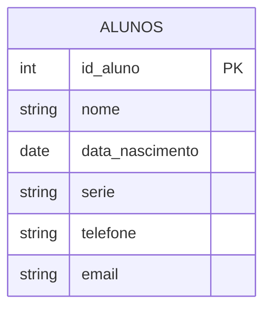
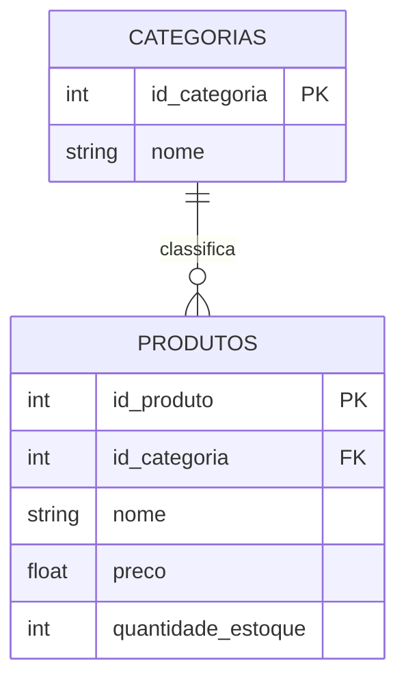
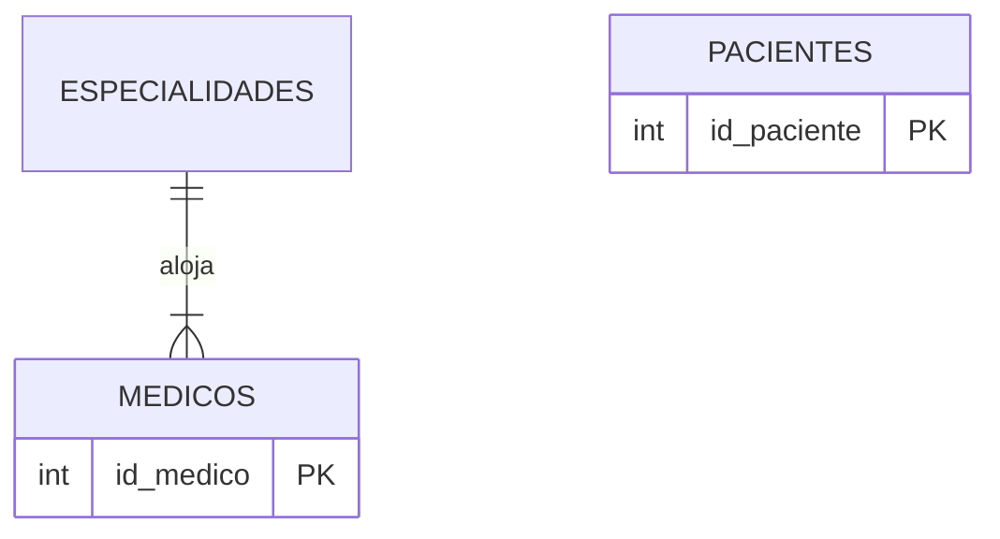
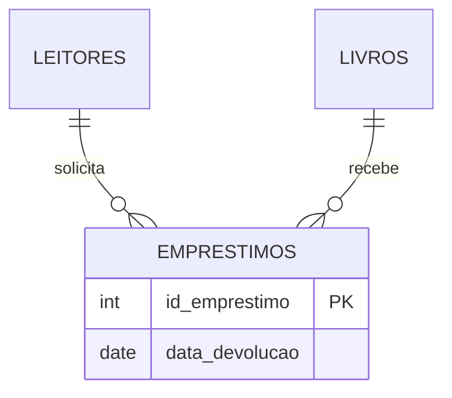
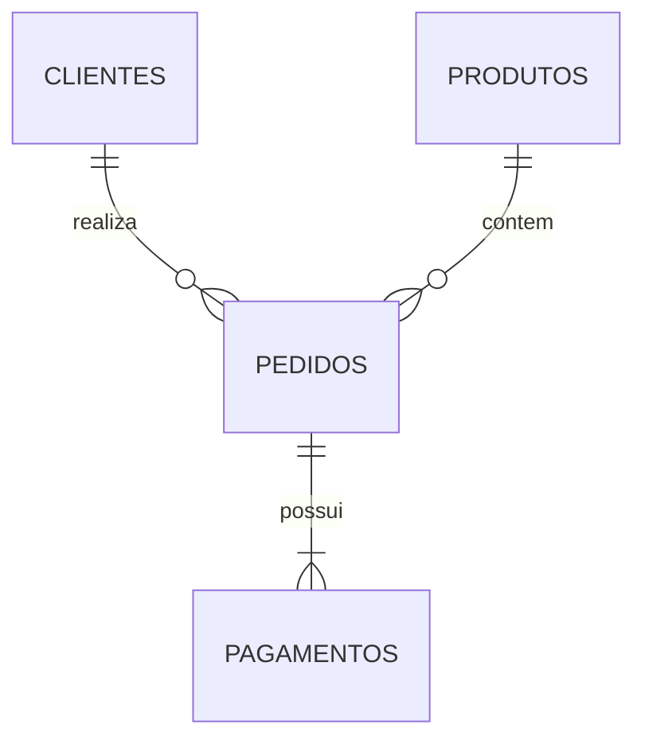
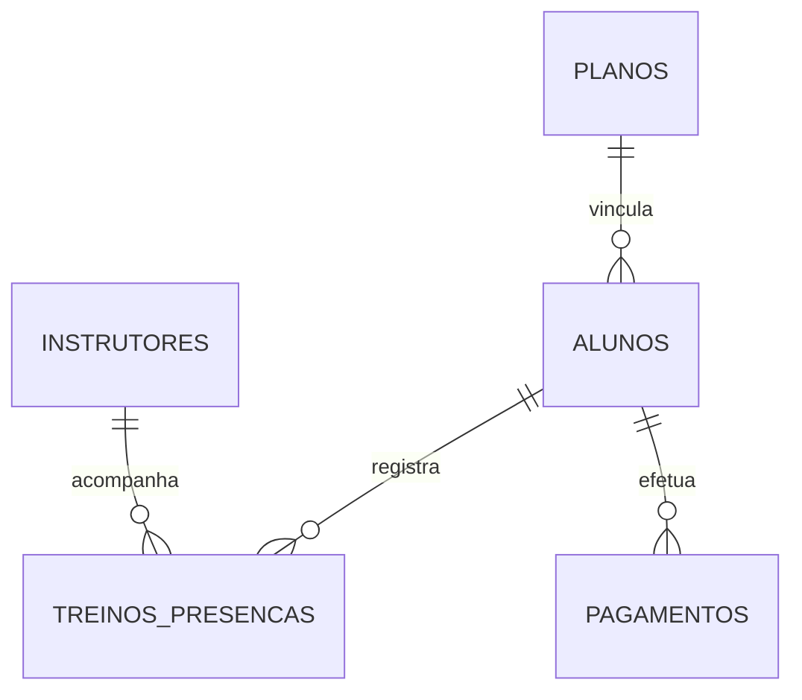
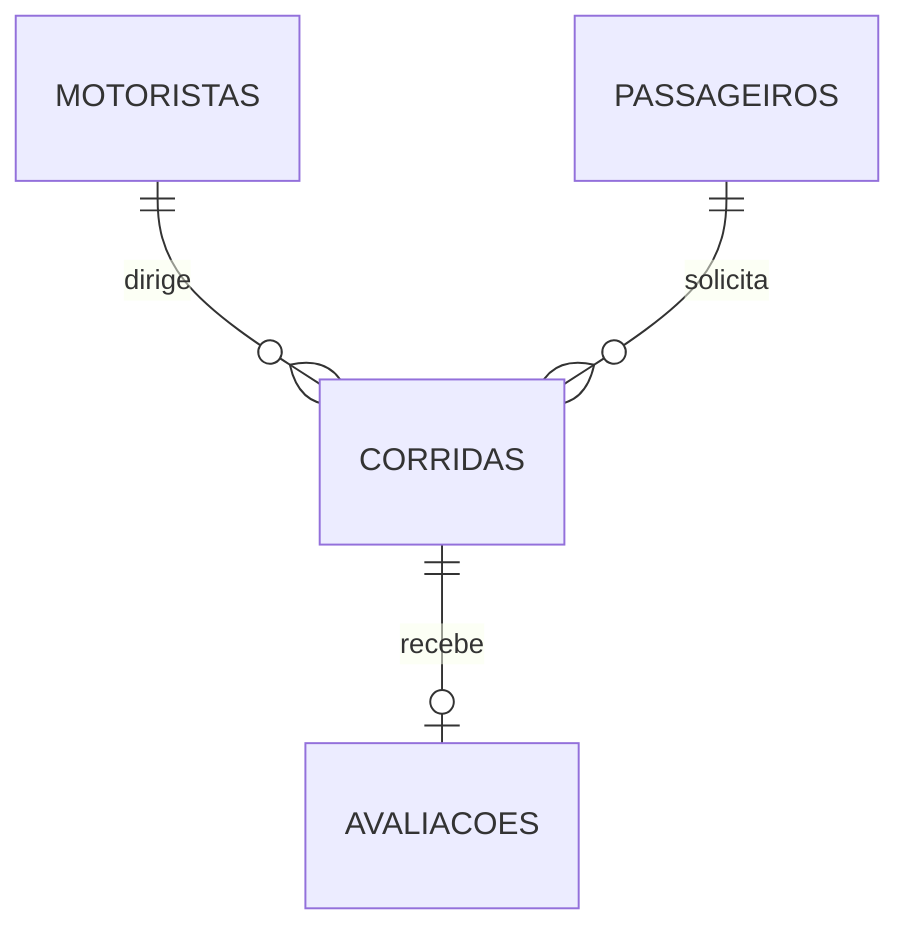
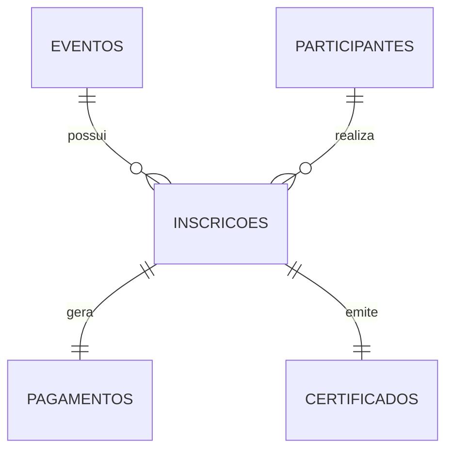
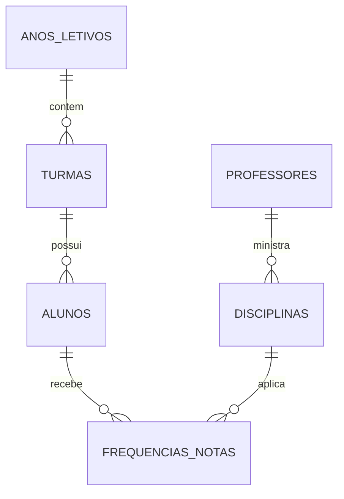
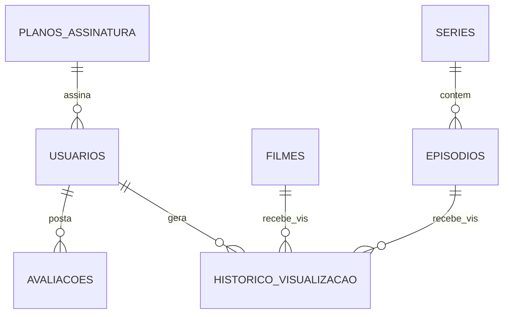

# Lista de Exercícios - Identificando Entidades e Atributos

---

## 1) Sistema de Cadastro de Alunos
- **Entidades:** `alunos`
- **Atributos:**
  - `id_aluno` (identificador principal)
  - `nome`
  - `data_nascimento`
  - `serie`
  - `telefone`
  - `email`

---

## 2) Sistema de Produtos de uma Loja
- **Entidades:** `categorias`, `produtos`
- **Atributos:**
  - `categorias`: `id_categoria`, `nome`
  - `produtos`: `id_produto`, `nome`, `preco`, `quantidade_estoque`

---

## 3) Clínica Médica
- **Entidades:** `especialidades`, `medicos`, `pacientes`
- **Atributos:**
  - `especialidades`: `id_especialidade`, `nome`, `descricao`
  - `medicos`: `id_medico`, `nome`, `crm`, `telefone`
  - `pacientes`: `id_paciente`, `nome`, `cpf`, `data_nascimento`

---

## 4) Sistema de Biblioteca
- **Entidades:** `leitores`, `livros`, `emprestimos`
- **Atributos:**
  - `leitores`: `id_leitor`, `nome`, `cpf`, `telefone`
  - `livros`: `id_livro`, `titulo`, `autor`, `ano_publicacao`
  - `emprestimos`: `id_emprestimo`, `id_leitor`, `id_livro`, `data_emprestimo`, `data_devolucao`

---

## 5) Sistema de Loja Online
- **Entidades:** `clientes`, `produtos`, `pedidos`, `pagamentos`
- **Atributos:**
  - `clientes`: `id_cliente`, `nome`, `email`, `cpf`
  - `produtos`: `id_produto`, `nome`, `preco`, `estoque`
  - `pedidos`: `id_pedido`, `id_cliente`, `data`, `status`
  - `pagamentos`: `id_pagamento`, `id_pedido`, `valor`, `metodo_pagamento`

---

## 6) Sistema de Academia
- **Entidades:** `alunos`, `planos`, `instrutores`, `treinos_presencas`, `pagamentos`
- **Atributos:**
  - `planos`: `id_plano`, `nome`, `valor_mensal`
  - `instrutores`: `id_instrutor`, `nome`, `cpf`
  - `alunos`: `id_aluno`, `id_plano`, `nome`, `ativo`
  - `treinos_presencas`: `id_presenca`, `id_aluno`, `id_instrutor`, `data`
  - `pagamentos`: `id_pagamento`, `id_aluno`, `data_pagamento`, `valor`

---

## 7) Aplicativo de Transporte
- **Entidades:** `motoristas`, `passageiros`, `corridas`, `avaliacoes`
- **Atributos pertinentes:**
  - `motoristas`: `id_motorista`, `nome`, `cnh`, `placa_carro`
  - `passageiros`: `id_passageiro`, `nome`, `telefone`, `pagamento_padrao`
  - `corridas`: `id_corrida`, `id_motorista`, `id_passageiro`, `origem`, `destino`
  - `avaliacoes`: `id_avaliacao`, `id_corrida`, `nota`, `comentario`

---

## 8) Sistema de Eventos
- **Percepção Teórica:** A entidade *inscrições* atua como intermédio entre Eventos e Participantes, justificando ser uma entidade própria (Tabela Associativa N:N) e até concentrando pagamentos / recibos de certificado.
- **Entidades:** `eventos`, `palestrantes`, `participantes`, `inscricoes`, `certificados`, `pagamentos`
- **Atributos:**
  - `eventos`: `id_evento`, `id_palestrante`, `nome_evento`, `data`
  - `participantes`: `id_participante`, `nome`, `email`
  - `inscricoes`: `id_inscricao`, `id_evento`, `id_participante`, `data_inscricao`
  - (*Certificados e Pagamentos dependem estritamente da inscrição gerada*).

---

## 9) Sistema Escolar Completo
- **Percepção Teórica (Dependências):** *Turma* depende do *Ano Letivo*. *Notas/Frequência* dependem inteiramente que `Aluno` e `Disciplina/Turma` existam (Associação complexa).
- **Entidades:** `anos_letivos`, `professores`, `disciplinas`, `turmas`, `alunos`, `frequencias_notas`
- **Atributos Principais:**
  - `turmas`: `id_turma`, `id_ano`, `sala`
  - `alunos`: `id_aluno`, `id_turma`, `nome`
  - `disciplinas`: `id_disciplina`, `id_professor`, `nome_mat`
  - `frequencias_notas`: `id_registro`, `id_aluno`, `id_disciplina`, `nota`, `faltas`

---

## 10) Plataforma de Streaming
- **Percepção Teórica (Relacionamentos Diretos):** `Episódios` relaciona-se estritamente com `Séries`. `Histórico` e `Avaliações` relacionam diretamente o `Usuário` ao Conteúdo (`Filme` ou `Episódio`).
- **Entidades Principais:** `planos_assinatura`, `usuarios`, `filmes`, `series`, `episodios`, `historico_visualizacao`, `avaliacoes`
- **Atributos Relevantes:**
  - `usuarios`: `id_usuario`, `id_plano`, `nome`, `email`
  - `filmes`: `id_filme`, `titulo`, `duracao`, `genero`
  - `series`: `id_serie`, `titulo`, `qtd_temporadas`
  - `episodios`: `id_episodio`, `id_serie`, `titulo`, `temporada`
  - `historico`: `id_hist`, `id_usuario`, `data_assistido`

