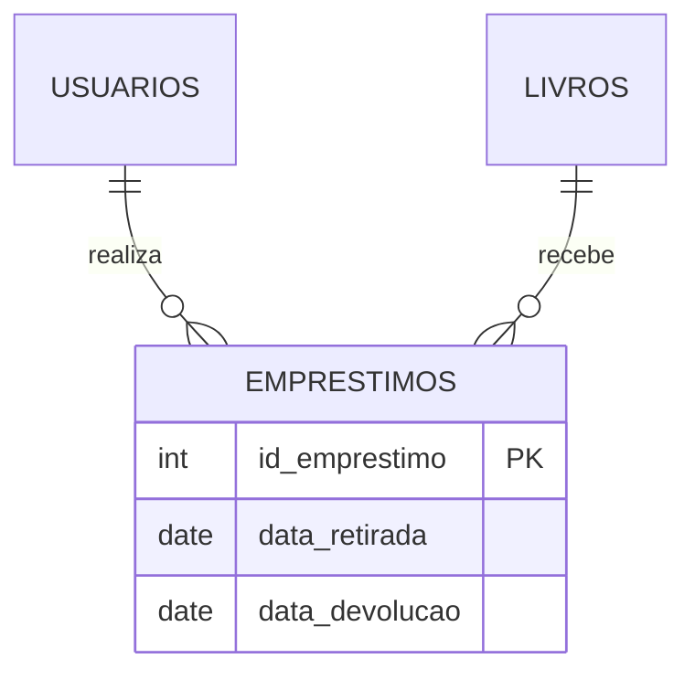
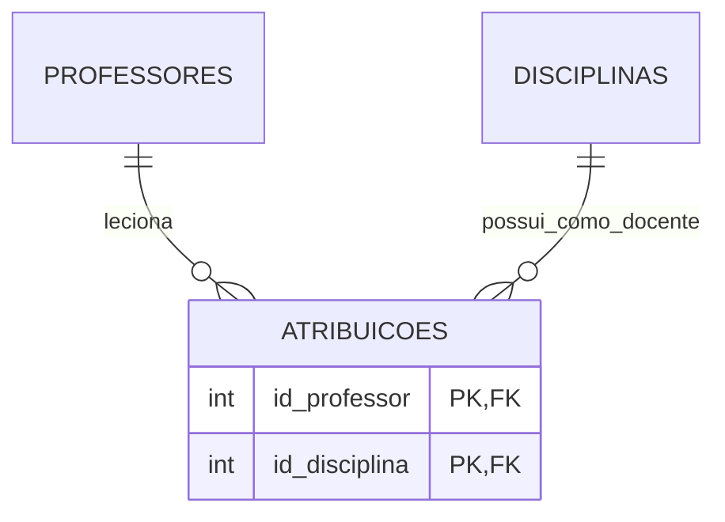
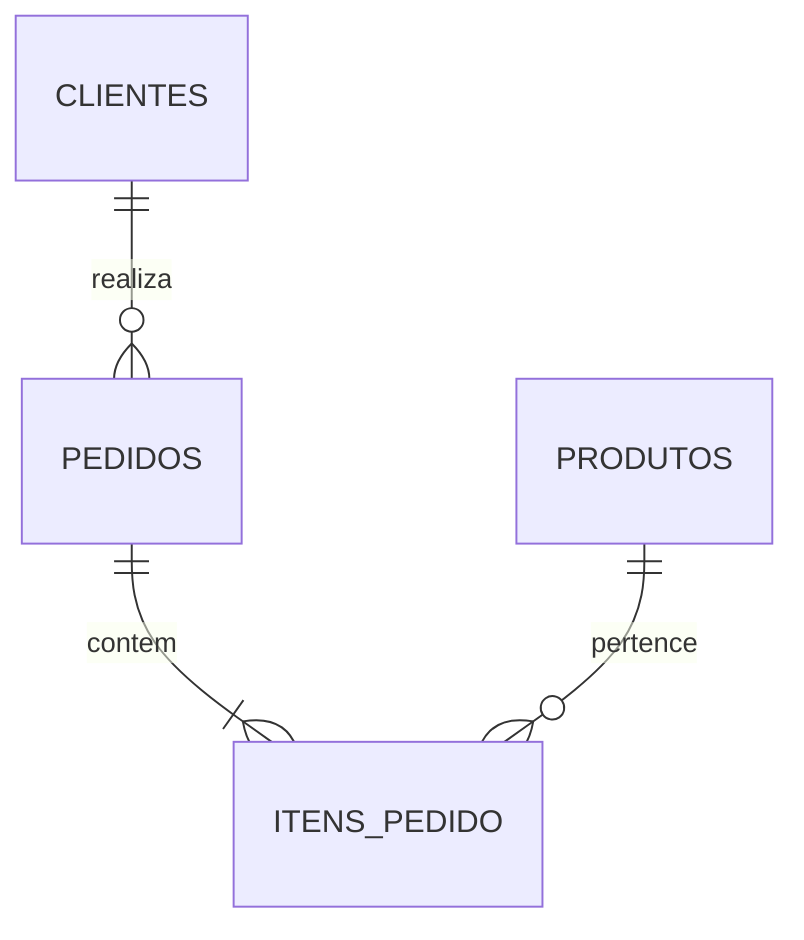
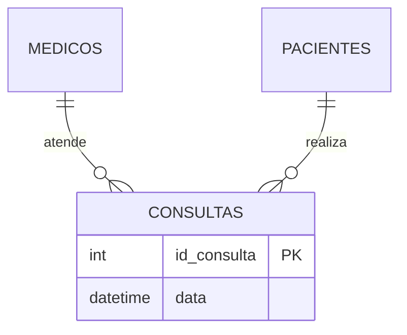
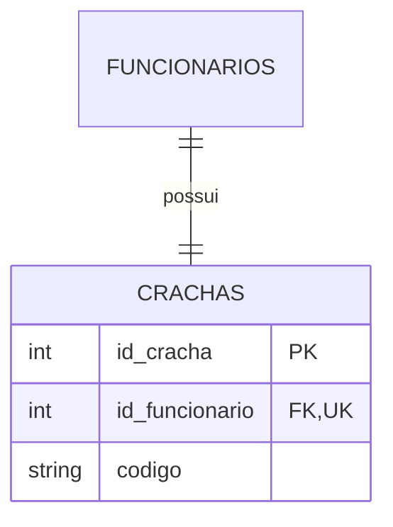
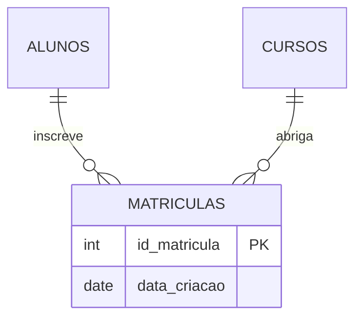
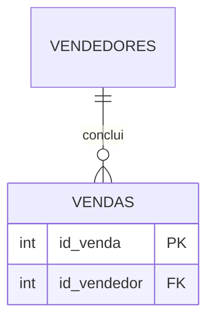
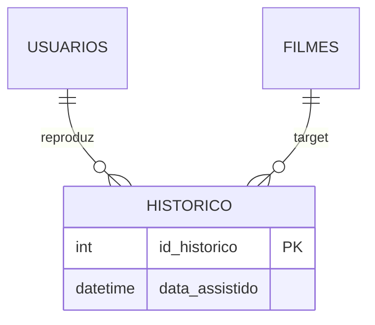
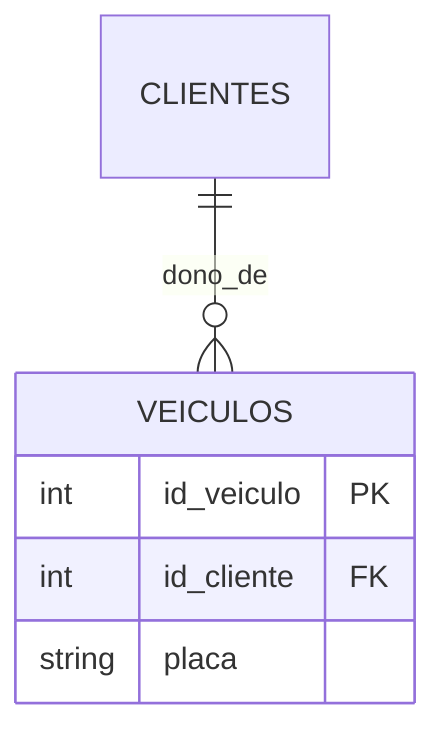
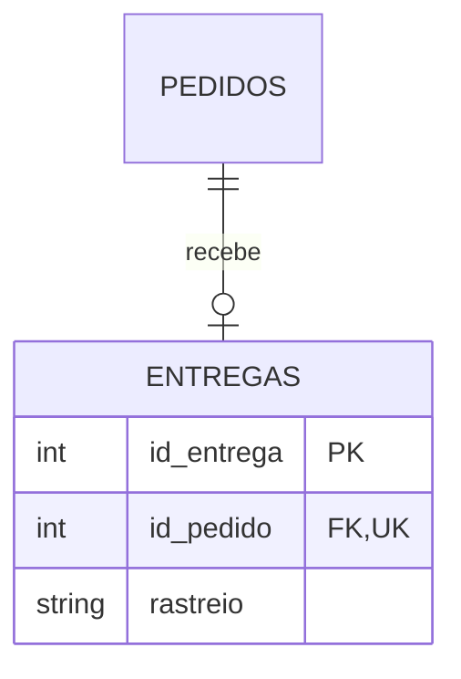

# Lista de Exercícios - Modelagem e Lógico (DER)

---

## Exercício 1 – Sistema de Biblioteca
- **Entidades:** `Usuarios`, `Livros`, `Emprestimos`.
- **Atributos Principais:** 
  - Livros: `id_livro` (PK), `titulo`.
  - Usuarios: `id_usuario` (PK), `nome`.
  - Emprestimos: `id_emprestimo` (PK), `data_retirada`, `data_devolucao`.
- **Relacionamentos e Cardinalidade:**
  - Usuários realizam Empréstimos (1:N)
  - Livros compõem Empréstimos (1:N)
  - *Livros e Usuários*: **N:N** (resolvido por `Emprestimos`).
- **Desafio/Como funciona:** O Empréstimo atua como o registro histórico do vínculo entre quem pegou e qual livro pegou num intervalo de tempo. **Sim**, existe a necessidade dessa entidade associativa; sem ela, não se guardaria o fato histórico da retirada com datas.

---

## Exercício 2 – Escola
- **Entidades:** `Professores`, `Disciplinas`, `Professores_Disciplinas` (Associativa).
- **Atributos Principais:**
  - Professores: `id_professor` (PK), `nome`.
  - Disciplinas: `id_disciplina` (PK), `nome`.
- **Relacionamentos e Cardinalidade:**
  - `Professores` *ministram* `Disciplinas` (**N:N**).
- **Atenção:** O relacionamento **não é direto**. Precisa de uma tabela intermediária pois cada professor dá muitas disciplinas e cada disciplina possui múltiplos professores possíveis no quadro docente.

---

## Exercício 3 – Loja Virtual
- **Entidades:** `Clientes`, `Pedidos`, `Produtos`, `Itens_Pedido`.
- **Atributos Principais:**
  - Clientes: `id_cliente` (PK), `nome`.
  - Pedidos: `id_pedido` (PK), `id_cliente` (FK).
  - Produtos: `id_produto` (PK), `descricao`, `preco`.
  - Itens_Pedido: `id_pedido`, `id_produto`, `quantidade`.
- **Relacionamentos e Cardinalidade:**
  - Cliente *realiza* Pedidos (**1:N**).
  - Pedidos *possuem* Produtos (**N:N**).
- **Desafio:** Resolvendo o **N:N** cria-se a entidade associativa `Itens_Pedido` (ou detalhes do pedido), garantindo que vários produtos caibam em 1 pedido e 1 produto apareça em infinitos pedidos de múltiplos clientes.

---

## Exercício 4 – Clínica Médica
- **Entidades:** `Medicos`, `Pacientes`, `Consultas`.
- **Atributos Principais:**
  - Medicos: `id_medico` (PK), `nome`.
  - Pacientes: `id_paciente` (PK), `nome`.
  - Consultas: `id_consulta` (PK), `data`, `id_medico`, `id_paciente`.
- **Relacionamentos e Cardinalidade:**
  - Médicos *atendem* Pacientes (**N:N** relacionalmente, mas instanciado via consultas).
- **Pergunta:** Esse relacionamento **não é direto**, ele se manifesta pela entidade de `Consulta` (associativa). **Sim**, é explicitamente necessário registrar a `data` da consulta, pois o mesmo paciente agendará infinitos encontros ao longo dos anos com esse ou outros médicos.

---

## Exercício 5 – Sistema de Funcionários
- **Entidades:** `Funcionarios`, `Crachas`.
- **Atributos Principais:**
  - Funcionarios: `id_funcionario` (PK), `nome`.
  - Crachas: `id_cracha` (PK), `codigo`, `id_funcionario` (FK, UK).
- **Relacionamentos e Cardinalidade:**
  - A cardinalidade é estrita de **1:1** (Um para Um). Um crachá pertence a apenas 1 funcionário.
- **Desafio:** Dependendo da regra de negócio, a relação pode ser Obrigatória (todo funcionário deve ter um crachá) ou parcial (apenas terceirizados usam). Normalmente a inserção do `Cracha` exige um usuário, fazendo-a obrigatória por referência (Chave Estrangeira restrita e `NOT NULL`).

---

## Exercício 6 – Faculdade
- **Entidades:** `Alunos`, `Cursos`, `Matriculas`.
- **Atributos Principais:**
  - Alunos: `id_aluno` (PK), `nome`.
  - Cursos: `id_curso` (PK), `titulo`.
  - Matriculas: `id_matricula` (PK), `id_aluno`, `id_curso`, `data_criacao`.
- **Relacionamentos e Cardinalidade:**
  - Aluno e Cursos mantêm **N:N**. 
- **Atenção:** A entidade "Matrícula" funciona quebrando o N:N, armazenando status financeiro ou situação do vínculo permanente entre ambos.

---

## Exercício 7 – Sistema de Vendas
- **Entidades:** `Vendedores`, `Vendas`.
- **Atributos Principais:**
  - Vendedores: `id_vendedor` (PK), `nome`.
  - Vendas: `id_venda` (PK), `valor`, `id_vendedor` (FK).
- **Relacionamentos e Cardinalidade:**
  - Vendedor *realiza* Vendas (**1:N**). Cada venda tem 1 vendedor.
- **Desafio:** A **Chave Estrangeira** (FK) obrigatoriamente ficará no lado **N** da relação, portanto migrará para dentro da tabela `Vendas` na forma da coluna `id_vendedor`.

---

## Exercício 8 – Plataforma de Streaming
- **Entidades:** `Usuarios`, `Filmes`, `Historico_Visualizacoes`.
- **Atributos Principais:**
  - Usuarios: `id_usuario` (PK).
  - Filmes: `id_filme` (PK).
  - Historico: `id_historico` (PK), `id_usuario` (FK), `id_filme` (FK), `data_assistido`, `minuto_parado`.
- **Relacionamentos e Cardinalidade:**
  - Usuários e Filmes mantêm relação de visualização em **N:N**.
- **Pergunta / Desafio:** Para registrar o histórico exato de visualização, cria-se a entidade associativa. Ela armazenará cada ocorrência (quando ele deu play, em que dia, e onde parou).

---

## Exercício 9 – Oficina Mecânica
- **Entidades:** `Clientes`, `Veiculos`.
- **Atributos Principais:**
  - Clientes: `id_cliente` (PK), `nome`.
  - Veiculos: `id_veiculo` (PK), `placa`, `id_cliente` (FK).
- **Relacionamentos e Cardinalidade:**
  - Um cliente possui infinitos carros. Contudo cada veículo está nominal a um único responsável pela conta na oficina.
- **Desafio:** A cardinalidade é de **1:N**. 
  - Lado **1**: `Clientes` (quem detém as posses).
  - Lado **N**: `Veiculos` (quem contem a Chave Estrangeira `id_cliente`).

---

## Exercício 10 – Sistema de Pedidos com Entrega
- **Entidades:** `Pedidos`, `Entregas`.
- **Atributos Principais:**
  - Pedidos: `id_pedido` (PK), `data_compra`.
  - Entregas: `id_entrega` (PK), `rastreio`, `id_pedido` (FK unica).
- **Relacionamentos e Cardinalidade:**
  - Relação estritamente em **1:1** (Um para Um). Um pedido tem uma etiqueta de frete/entregador, e um fluxo de entrega refere-se apenas a um pedido.
- **Pergunta/Desafio:** Dependência não precisa ser simultânea. Pode existir o pedido que *ainda* não teve entrega gerada (não foi embalado), logo a relação **não é sempre obrigatória no ato da criação (mas o inverso sim)**.

